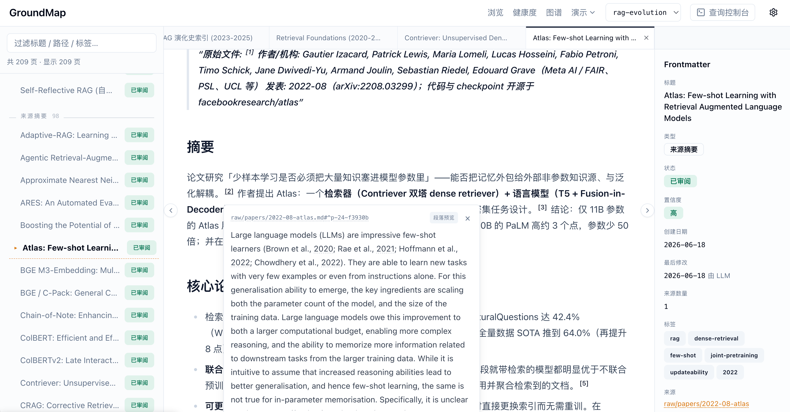
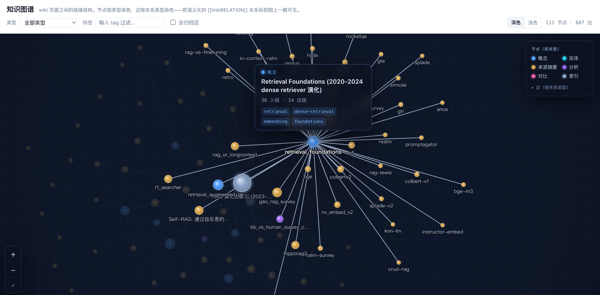
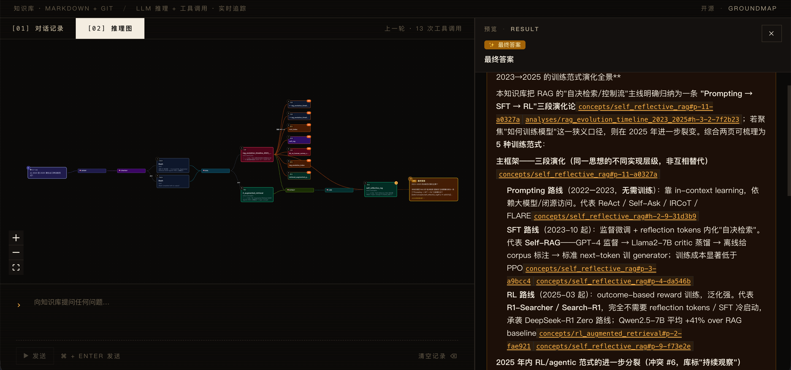

# GroundMap

Source-grounded knowledge map for humans and AI agents.

English | [简体中文](README.zh-CN.md)

GroundMap is a local-first knowledge map built on Markdown, Git, stable block anchors, and full-page agent reading. It is designed for teams and solo builders who want auditable, source-grounded knowledge without vector databases, document chunking, or hidden LLM runtime inside the core repository.

## Why It Exists

Most RAG systems optimize for recall first: split documents into chunks, embed them, retrieve fragments, and ask an LLM to reconstruct context.

GroundMap starts from a different premise:

- Knowledge should stay human-readable.
- Markdown + Git should remain the source of truth.
- Agents should read complete pages or complete sections, not arbitrary chunks.
- Every important claim should point back to a stable source anchor.
- The knowledge base itself should not call an LLM.

That gives you an AI-ready wiki that is easier to audit, diff, review, and maintain over time.

## Core Ideas

- **No embeddings by default**: search uses BM25-style text search, metadata, backlinks, outlinks, and full-page reading.
- **Stable anchors**: converted raw documents get block anchors such as `^h-*`, `^p-*`, and `^t-*` so claims can cite exact source blocks.
- **Markdown is truth**: SQLite/cache layers are optional derived indexes and can be rebuilt.
- **Agent outside, KB inside**: the repository exposes scripts, templates, and Web UI. LLM reasoning happens in external agents.
- **Git-native governance**: all meaningful changes can be reviewed, reverted, audited, and discussed as normal commits.
- **Human-only zones**: `raw/**`, `my_thoughts/**`, `#human-only`, and `locked: true` files are protected by policy and hooks.
- **Typed relation graph**: wikilinks can carry semantic relation types (`SUPPORTS`, `REFUTES`, `EXTENDS`, …), linted against a whitelist and rendered as an interactive graph at `/graph` in the Web console.

## Recommended Agent Workflow

GroundMap is designed to be managed with coding agents such as **Claude Code**, **Codex**, Cursor-style agents, or any tool that can read files, edit Markdown, and run shell commands. The agent handles LLM reasoning outside the knowledge base: it reads full wiki pages, calls `scripts/k.py` for search/outline/backlinks/health checks, updates `wiki/**` Markdown, and commits changes through Git.

For best results, ask your agent to read `CLAUDE.md` or `AGENTS.md` before working in the repository. Those files define the operating rules for ingesting sources, answering queries, resolving conflicts, protecting human-only areas, and keeping the Markdown knowledge base auditable.

## Product Screenshots

Browse complete wiki pages with frontmatter, source citations, and block previews.



Explore typed wiki relations as an interactive knowledge graph.



Use the optional debug console to inspect agent reasoning, tool calls, and grounded answers.



## Quickstart

Requirements:

- Python 3.10+
- Node.js 20+
- npm

```bash
git clone https://github.com/Qinbf/groundmap.git
cd groundmap

make setup
make test
make web
```

Then open [http://localhost:3006](http://localhost:3006).

> 📦 **Example `raw/` sources are not distributed with this repository** (copyright reasons; `workspaces/*/raw/` is excluded by `.gitignore`). The example workspaces ship their full `wiki/` pages, which remain completely browsable. After a fresh clone, `k.py health` reports nonzero **broken references** (across the example workspaces — "raw 文件不存在" / raw file missing) and **source issues** (`broken-source-link`: `source_summary` pages cite `[[raw/...]]` blocks that aren't present) — **both are expected and do not mean your installation failed**; they are the same raw-absent artifact, only the deep links into missing raw blocks are unresolved. To exercise the full convert → cite loop, ingest your own documents into a workspace's `raw/`.

Manual setup:

```bash
python -m pip install -r requirements-dev.txt
cd web && npm install && cd ..
bash scripts/install_hooks.sh

python -m pytest scripts/tests
python scripts/k.py health --json
cd web && npm run lint && npm run build
```

> ⚠️ **Stop your dev server before running `npm run build`.** The Web console (`npm run dev`) and `next build` share the same `web/.next/` directory. Running a production build while a dev server is live can leave the dev server serving 404s. To validate types only without building, run `cd web && npx tsc --noEmit` instead. (CI runs the full build in a clean environment, which is fine.)

### Working behind a proxy (Clash / VPN / etc.)

Local servers listen on `localhost` (Web console `:3006`, debug console `:3100`). With a system/terminal proxy active:

- **One command (recommended):** `make dev` starts the Web console (`:3006`) and the debug console (`:3100`) together (Ctrl-C stops both); `make web` starts just the Web console. Both set `no_proxy=localhost,127.0.0.1,::1`, so the local servers and their child processes are never routed through the proxy — they start **whether or not a proxy is on**.
- **Using `npm` directly:** if you bypass the Makefile with `cd web && npm run dev` and have no global `no_proxy`, command-line tools may send loopback requests to the proxy. Use `make` instead, or `export no_proxy=localhost,127.0.0.1,::1` first (persist it in `~/.zshenv`).
- **Browser:** Chrome / Safari / recent Firefox bypass `localhost` by default. If a proxy extension (e.g. SwitchyOmega) breaks access, add `localhost, 127.0.0.1` to its bypass list.
- **Blank page:** usually a corrupted `.next` cache (after switching branches / large edits), unrelated to the proxy — run `make clean` and restart.

## Workspaces

Engine code (`scripts/`, `web/`) is shared; data is isolated per topic under `workspaces/<name>/`. Each workspace has the same internal layout: `wiki/`, `raw/`, `exports/`, `my_thoughts/`, `.cache/`, and `log.md`. When no workspace is specified, the CLI auto-selects one (and prints a hint when several exist); pass `--workspace` to choose.

```bash
# No --workspace: auto-selects a workspace (prints a hint when several exist)
python scripts/k.py health --json

# Target a specific workspace
python scripts/k.py --workspace ai-ml-demo search "transformer"
cd web && KB_WORKSPACE=rag-evolution npm run dev
```

This repository ships three example workspaces: `smb-ecommerce`, `rag-evolution`, and `ai-ml-demo`. The first two are living demos; `ai-ml-demo` is an archived v0 library kept on purpose — most of its pages carry `status: deprecated`, demonstrating the "mark, never delete" archival workflow.

The web top bar includes a **workspace switcher** (writes a `kb_workspace` cookie and reloads), so you can switch libraries live in the UI without restarting; `KB_WORKSPACE` sets the initial default. The cookie value is validated against the real workspace list (`resolveWorkspace()`), so a tampered cookie can't escape the workspaces directory.

### Reusing one engine across independent projects

The engine (`scripts/`, `web/`) is a shared tool. Each independent project keeps its own knowledge base **in that project's own folder** and points the engine at it via the `KB_ROOT` environment variable:

```bash
# Engine installed once; data lives in each project's own directory
KB_ROOT=~/work/project-a/kb-data python ~/tools/groundmap/scripts/k.py --workspace main health
cd ~/tools/groundmap/web && KB_ROOT=~/work/project-a/kb-data KB_WORKSPACE=main npm run dev
```

`KB_ROOT` must point to the data root that *contains* `workspaces/` (e.g. `<project>/kb-data`), not a specific workspace; `--workspace` / `KB_WORKSPACE` then picks the library inside it. When `KB_ROOT` is unset it defaults to the engine repo itself (data-in-repo, the multi-topic mode above). Keeping each project's data in its own folder lets the engine stay pure code — shared, upgraded, and open-sourced without leaking any project's data. See `GroundMap-设计文档.md` §2.4 for the full deployment model.

## Common Commands

All of the following work on a fresh clone (they only read the bundled `wiki/` pages):

```bash
python scripts/k.py health --json
python scripts/k.py --workspace rag-evolution search "retrieval"
python scripts/k.py --workspace rag-evolution outline wiki/sources/bge.md
python scripts/k.py list-conflicts
python scripts/k.py list-to-update
```

Web console (defaults to `http://127.0.0.1:3006`, local single-user; it does not bind to `0.0.0.0` unless you pass `-H` explicitly):

```bash
cd web
npm run dev
```

## Repository Layout

```text
.
├── CLAUDE.md                 # Schema / behavior spec (single source of truth)
├── AGENTS.md                 # Codex mirror of CLAUDE.md (kept byte-aligned)
├── GroundMap-设计文档.md        # System design document
├── scripts/                  # CLI (k.py), conversion (convert.py), parsing, tests, hooks
├── web/                      # Next.js reading/editing console (+ REST/server actions)
├── .claude/skills/           # Claude Code workflow skills (kb-ingest / query / lint / export / conflict-resolve)
├── .agents/skills/           # Codex mirror of the skills above
├── wiki/_templates/          # Shared page templates (used by all workspaces)
├── workspaces/               # Per-topic data, switchable; ships smb-ecommerce / rag-evolution / ai-ml-demo examples
│   └── <name>/
│       ├── wiki/             # Markdown wiki pages (root_index, indexes, concepts, entities, sources, analyses)
│       ├── raw/              # Source documents and converted markdown (articles, papers, assets)
│       ├── exports/          # Generated outputs
│       ├── my_thoughts/      # Human-only zone (agent read-only)
│       ├── .cache/           # Derived SQLite index (gitignored, rebuildable)
│       └── log.md            # Operation log
├── docs/                     # Public documentation
├── tools/debug-console/      # Optional standalone debug console (external KB client; see its README)
├── .github/                  # CI, issue templates, PR template
└── requirements*.txt         # Python dependencies
```

There is no `backend/` directory: the original MCP + REST backend was deprecated (see `GroundMap-设计文档.md` §10.5). REST and write actions are served by `web/` instead.

## What GroundMap Is Not

GroundMap intentionally does not include:

- embedded LLM SDK calls in the core knowledge base,
- embedding models or vector stores for default retrieval,
- hidden chunking pipelines,
- a hosted multi-tenant SaaS layer,
- private industry playbooks.

Those boundaries are deliberate. The open-source core focuses on the durable knowledge substrate; product-specific agents, workflows, and enterprise integrations can live outside it.

## Documentation

- 🎓 **[Step-by-step beginner tutorial (中文, with screenshots)](docs/新手教程-手把手搭建知识库.md)** — zero-to-running walkthrough with a full worked example; the best place to start (also available as a [standalone HTML page](docs/新手教程-手把手搭建知识库.html) with a sidebar TOC for offline reading)
- [Quickstart](docs/quickstart.md)
- [Why No Embeddings](docs/why-no-embeddings.md)
- [Demo Plan](docs/demo.md)
- [Web Console](web/README.md)

## Roadmap

- Public demo workspace with redistributable sources.
- Packaged CLI command, for example `groundmap health`.
- Better onboarding walkthrough in the Web console.
- Optional derived SQLite/FTS index for large repositories.

See `AGENTS.md` for the design contracts and future evolution notes.

## Contributing

Contributions are welcome, especially around documentation, tests, onboarding, CLI ergonomics, and Web UI polish. Please read [CONTRIBUTING.md](CONTRIBUTING.md) first.

## License

This project is licensed under the Apache License 2.0. See [LICENSE](LICENSE).

The Apache-2.0 license applies to the open-source core. Private industry playbooks, customer-specific workflows, and hosted product layers can be maintained separately.
