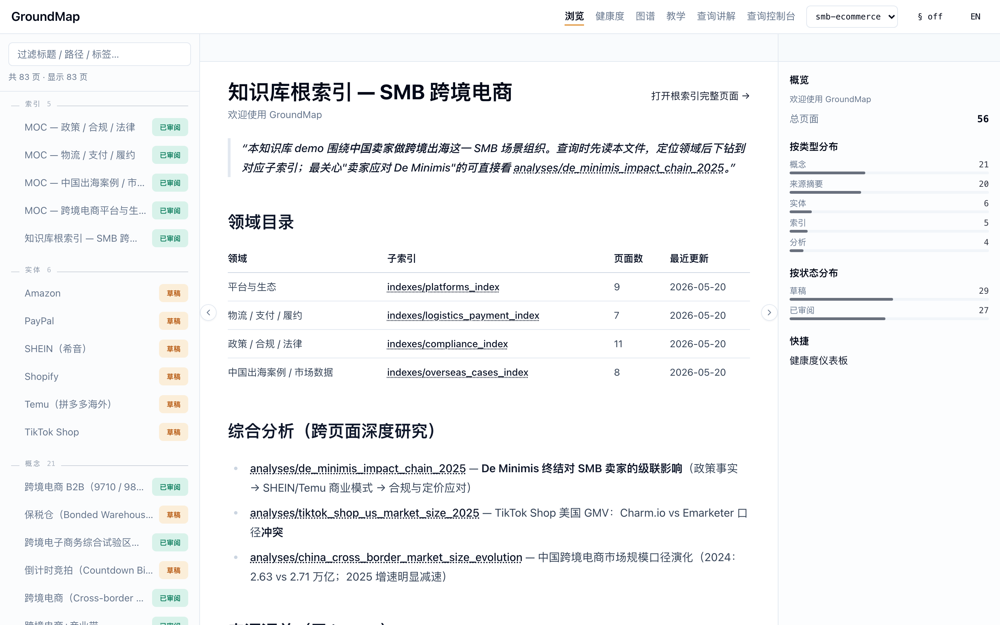
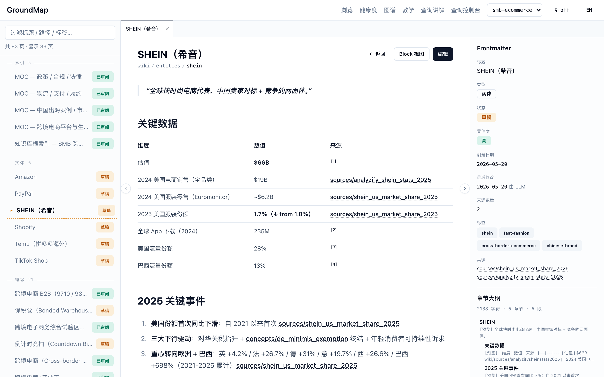
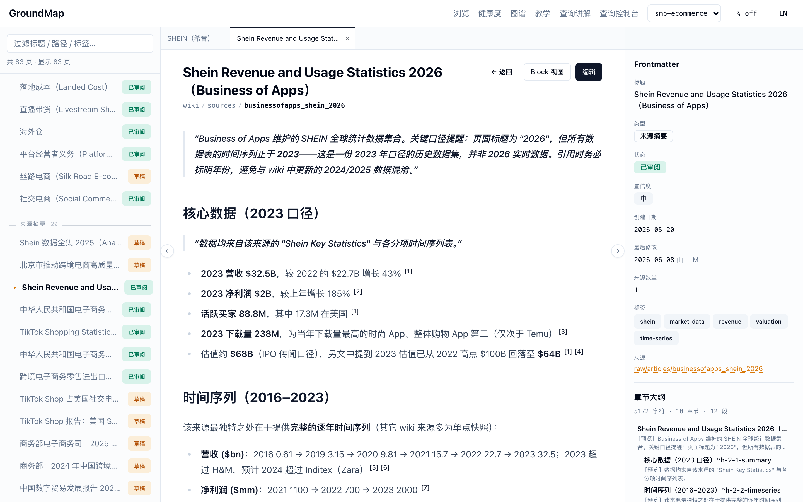
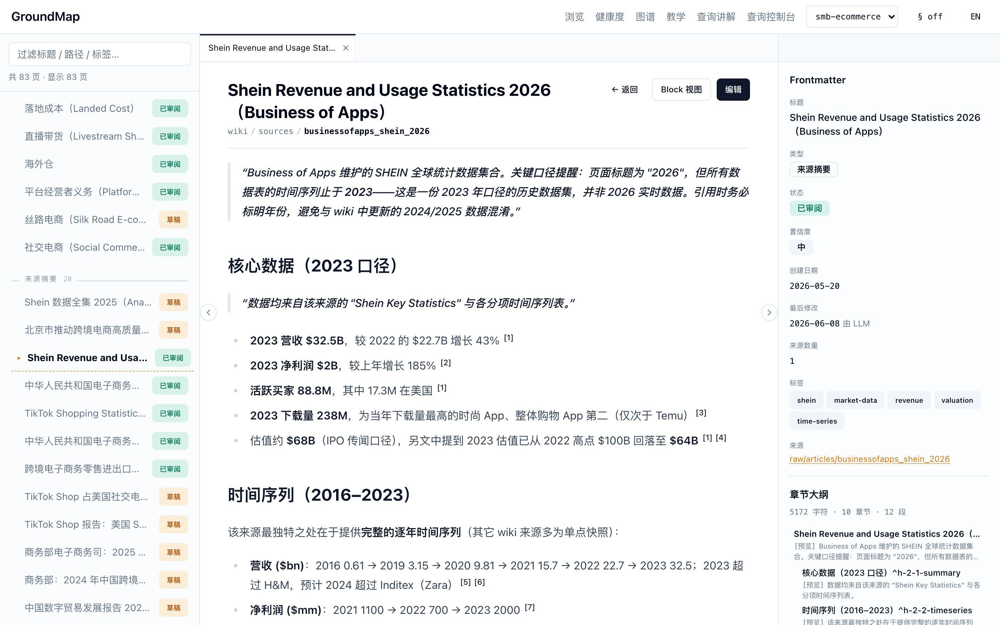
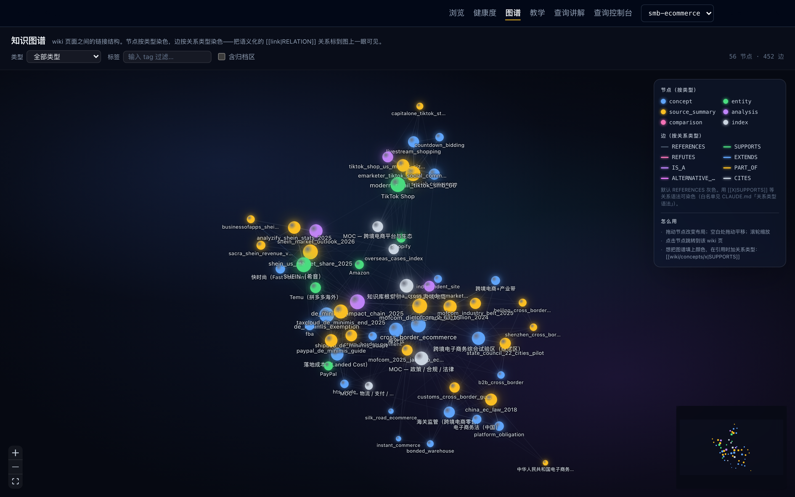
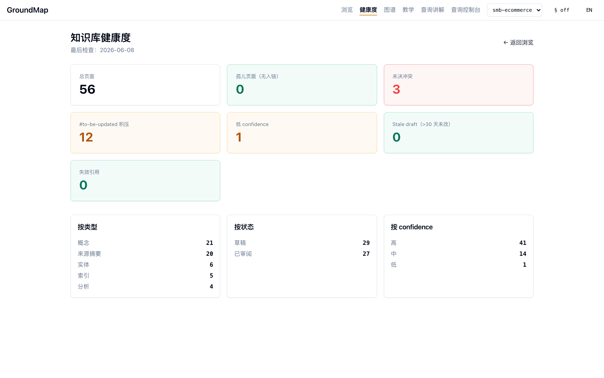
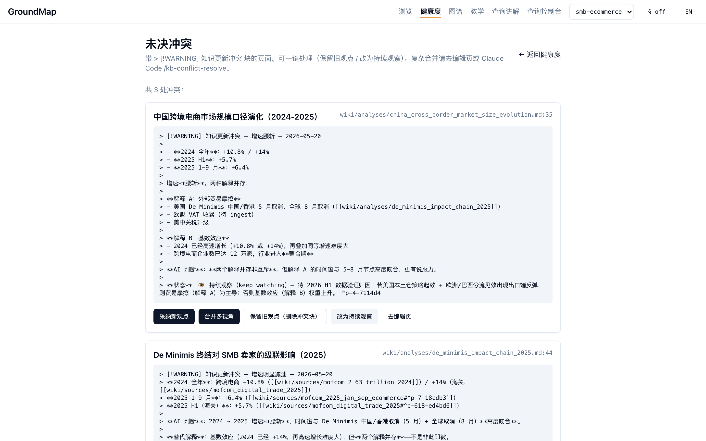

# 手把手搭建并使用 GroundMap 知识库（零基础图文教程）

> 这份教程写给**完全没接触过这个项目的新手**。读完你会明白：这个知识库是**一步一步怎么搭起来的**、搭好以后**怎么用、怎么转**。全程配真实截图，并用**完整案例**从头走到尾——既有现成的讲解案例（一篇 SHEIN 统计报告如何变成可追溯的知识），也有配套示例文章让你**亲手跟做一遍**，最后教你从零开一个自己主题的库。
>
> **需要的基础**：几乎为零。你只要会在终端里复制粘贴命令、会用浏览器即可。看不懂的名词，文中第一次出现时都会用大白话解释。

---

## 目录

1. [先建立直觉：GroundMap 到底是什么](#1-先建立直觉groundmap-到底是什么)
2. [5 分钟把它跑起来](#2-5-分钟把它跑起来)
3. [看懂一个"知识页"——知识库的原子单位](#3-看懂一个知识页知识库的原子单位)
4. [核心案例：喂一篇资料，看它如何变成知识](#4-核心案例喂一篇资料看它如何变成知识)
5. [知识库建好后，怎么用它](#5-知识库建好后怎么用它)
6. [日常维护：让知识库长期不腐烂](#6-日常维护让知识库长期不腐烂)
7. [建你自己的知识库：从零开一个新主题](#7-建你自己的知识库从零开一个新主题)
8. [进阶（按需）](#8-进阶按需)
9. [常见问题排错](#9-常见问题排错)
10. [附录：一图看懂整个工作流](#10-附录一图看懂整个工作流)

---

## 1. 先建立直觉：GroundMap 到底是什么

先别管代码。用一个比喻就懂了：

> **GroundMap = 一座图书馆 + 一位 AI 管理员 + 一本永远可追溯的笔记本。**

- **你**：往图书馆塞原始资料（论文、报告、网页、政策文件……），并提问。
- **AI 管理员（外部 agent，比如 Claude Code）**：读这些原始资料，把要点**整理成结构化的 wiki 笔记**，而且**每一句话都标明出处**（来自哪份资料的哪一段）。
- **系统本身（`scripts/` 里的 `k.py` + `web/` 网页台）**：只负责**给工具**——转换格式、加书签（锚点）、搜索、画关系图、体检——它**自己从不思考、不调用任何 AI**。

### 三个"铁规矩"，理解它们就理解了整个设计

| 规矩 | 大白话 | 为什么 |
|---|---|---|
| **markdown + Git 是唯一真相** | 所有知识就是一堆纯文本 `.md` 文件，用 Git 存。删掉所有代码、所有缓存，知识本身还在、还能读。 | 永不被某个工具/某个模型"锁死"。十年后用记事本也能打开。 |
| **系统不调用 LLM、不用 embedding** | 知识库自己不接 AI、不做"向量召回"。检索靠**全文关键词 + 元数据过滤 + 让 agent 读完整页面**。 | 可解释、可复现、零幻觉风险。详见 [`why-no-embeddings.md`](why-no-embeddings.md)。 |
| **每条论断必须能溯源** | wiki 里写"SHEIN 估值 660 亿美元"，后面必须挂一个链接，**精确指向原始报告的那一段**。 | 知识可信、可核查，而不是"AI 说的，不知道哪来的"。 |

> 📌 **和传统 RAG 的关键区别**：常见的"chunk + embedding" RAG 把文档切碎、转成向量，检索时返回一些**零碎片段**，换个模型就得全量重算。GroundMap 反过来——**永远返回完整页面或完整章节**，知识以人能读懂的 markdown 形式沉淀下来，不进任何"换模型就作废"的黑盒。

记住这个三角关系，下面的一切都顺理成章：

```
        ┌─────────────┐   放资料 / 提问    ┌──────────────────────┐
        │     你       │ ───────────────▶ │  AI 管理员（外部 agent） │
        └─────────────┘                   │   读资料 → 写 wiki      │
              ▲                            │   每句话都标出处         │
              │ 看 wiki / 图谱 / 体检        └───────────┬──────────┘
              │                                         │ 用工具
        ┌─────┴───────────────────────────────────────▼──────┐
        │   系统（k.py + 网页台）：转换 / 锚点 / 搜索 / 图谱 / 体检   │
        │   —— 只给工具，自己从不调用 AI                          │
        └────────────────────────────────────────────────────┘
```

---

## 2. 5 分钟把它跑起来

### 2.1 前置条件

装好这几样（装过就跳过）：

- **Python 3.10 以上**
- **Node.js 22 以上** + **npm**
- **Git**
- **一个 AI 编程助手**（第 4 章摄入资料时才用到，可以先装好）：推荐 [Claude Code](https://claude.com/claude-code)——在终端运行 `npm install -g @anthropic-ai/claude-code` 安装，之后在任意目录输入 `claude` 即可进入对话。用 Cursor、Codex 等其他 agent 也完全可以。

> 💡 **小贴士**：
> - 本文所有命令里的 `python`，在部分系统（如 macOS 自带环境）上叫 `python3`。如果敲 `python` 提示 command not found，就把命令里的 `python` 换成 `python3`，其余不变。
> - `make` 在 macOS / Linux 一般自带；Windows 用户建议在 WSL 里操作，或直接用下文给出的"手动等价命令"。

### 2.2 下载并安装

```bash
git clone <仓库地址> groundmap
cd groundmap
make setup
```

> `<仓库地址>` 替换成本项目在 GitHub 上的地址——打开项目主页，点绿色 **Code** 按钮复制即可。如果你是直接下载的 zip 包，解压后 `cd` 进目录从 `make setup` 开始。

`make setup` 会一次性装好：Python 依赖、网页台依赖、本地 Git 钩子。

> 如果你不想用 `make`，手动三步等价：
> ```bash
> python -m pip install -r requirements-dev.txt   # Python 依赖
> cd web && npm install && cd ..                  # 网页台依赖
> bash scripts/install_hooks.sh                   # Git 钩子（写权限第二道防线）
> ```

### 2.3 体检一下，确认能跑

```bash
python scripts/k.py health --json
```

只要命令输出一串 JSON、其中 `"total_pages": 56`，就说明引擎正常。

> ⚠️ **新克隆仓库会看到约 287 条"失效引用"，这是预期现象，不代表装坏了。**
> 示例库的 `raw/` 原始资料（那些被整理过的报告、文章原文）**不随仓库分发**——它们可能含第三方版权内容，所以被 `.gitignore` 留在了作者本地。你克隆下来的是整理好的 `wiki/` 知识页。于是 wiki 里那些指向 raw 原文的引用就成了"查无此文件"，`health` 会如实报告 `"broken_refs_count": 287`、原因清一色是 `raw 文件不存在`。
> 判断标准就一条：**命令能跑出 JSON、`total_pages` 是 56，引擎就是好的**。等你在第 4 章放入自己的资料后，自己的引用链路是完整的。

### 2.4 打开网页台

```bash
make web
```

浏览器打开 **http://localhost:3006** ，你会看到这个界面：


*首页 = 知识库的"大堂"。这是 `smb-ecommerce`（跨境电商）示例库。*

逐区域认识一下（**记住这个布局，后面都用得到**）：

- **顶栏**：`浏览` `健康度` `图谱` —— 知识库的几大功能入口。右边是 **workspace 切换器**（当前 `smb-ecommerce`）和 **中/EN 语言切换**。
  - 顶栏还有一个 `查询控制台`：它**不是**网页台的内置页面，而是一个可选的独立调试子工具（跑在 3100 端口）。现在点它会"连接失败"——这是正常的，需要的话另开终端 `cd tools/debug-console && npm install && npm run dev` 启动；新手可以完全忽略它。
- **左侧栏**：搜索框 + **页面树**（按类型分组：MOC 索引（Map of Content，"内容地图"，即主题目录页）、实体如 Amazon/SHEIN/Temu、概念……）。点任意一项进入该页。
- **中间**：当前打开的是**根索引**（`root_index`），相当于整个知识库的"总目录"。
- **右侧栏**：**概览**——总页面数（56）、各类统计，一眼看出库有多大、健康不健康。

> 📌 **重要：`make web` 会一直占用这个终端窗口**（不停滚动日志），这是正常的，**别关它、别在里面按 Ctrl+C**（按了网页就打不开了）。后面章节的所有 `python scripts/k.py ...` 命令，请**新开一个终端标签页**（macOS 终端 ⌘T），并先 `cd` 回 groundmap 仓库目录再执行。

### 2.5 切换主题库（workspace）

这个仓库自带 **3 个示例库**，用顶栏下拉随时切换、无需重启：

- `smb-ecommerce`（默认）—— 跨境电商行业知识
- `rag-evolution` —— RAG 技术演进
- `ai-ml-demo` —— AI/ML 论文

> 命令行里切库用 `--workspace`：`python scripts/k.py --workspace ai-ml-demo search "transformer"`。

---

## 3. 看懂一个"知识页"——知识库的原子单位

知识库由一个个 **wiki 页**组成。先彻底看懂一页长什么样，后面就不会懵。

在左侧页面树点开 **SHEIN（希音）** 这个实体页：


*一个典型的"实体页"。注意右侧的 Frontmatter 和章节大纲。*

一页分三部分：

**① 正文（中间）**
- 标题、面包屑（`wiki/entities/shein`）。
- 「关键数据」表格：每一行的数值后面都有一个**「来源」链接**（如 `sources/analyzify_shein_stats_2025`）。这就是"每条论断可溯源"的体现——你能顺着链接查到这个数字是谁说的。
- 顶部还有 `编辑` 和 `Block 视图` 按钮（后者把整页拆成一个个带"书签"的小块）。

**② Frontmatter（右上）—— 这一页的"身份证"**

每个 wiki 页开头都有一段 **YAML 元数据**（Frontmatter，直译"前置事项"——写在文件最前面、用 `---` 包起来的几行 `字段: 值`），网页台把它渲染成右侧面板：

| 字段 | 含义 |
|---|---|
| `type` | 页面类型（这里是 `entity` 实体） |
| `status` | 状态：草稿 / 已审阅 / 已废弃 |
| `confidence` | 可信度：高 / 中 / 低 |
| `source_count` / `sources` | 这页引用了几个底层来源、分别是谁 |
| `tags` | 标签（`shein` `fast-fashion` `cross-border-ecommerce`…） |

**③ 章节大纲（右下）**：自动从正文标题生成，点一下就跳到对应章节。

### 锚点与块级引用：知识库的"精确书签"

打开一个**来源摘要页**（`source_summary`）——在左侧页面树的「来源摘要」分组里点 **Shein Revenue and Usage Statistics 2026（Business of Apps）**——往下滚，看正文里的小数字上标 `[1] [2]`：


*正文每条数据后面的 `[1][2]` 上标，就是"块级引用"——精确指向原始报告的某一段。*

这些上标背后是这样的语法（这是该页第 28 行的真实原文）：

```markdown
2023 营收 $32.5B，较 2022 的 $22.7B 增长 43% [[raw/articles/businessofapps_shein_2026#^p-53-b44b65]]
```

- `[[...]]` 是**双链**，指向另一份资料。
- `#^p-53-b44b65` 是**锚点**——相当于贴在原文第 53 段上的一个永久"书签"。`^p` = 段落，`^h` = 标题段，`^t` = 表格。
- 这些锚点是工具**自动生成**的（你不用手写），由 `^字母-序号-哈希` 三段组成，哈希保证内容变了能被检测出来。

> 💡 **为什么这么做？** 这样任何人（或任何 agent）看到一句结论，都能一键跳到**原文的那一段**去核对，而不是"在整篇 PDF 里大海捞针"。这就是"完整页面优先 + 精确溯源"。

### 五种页面类型，一句话各是什么

| 类型 | 干什么用 | 例子 |
|---|---|---|
| `source_summary` 来源摘要 | 一份原始资料的结构化摘要（1 对 1） | "Business of Apps SHEIN 统计报告" |
| `entity` 实体 | 一个公司/产品/机构 | SHEIN、TikTok Shop |
| `concept` 概念 | 一个术语/方法/制度 | "跨境支付"、"De Minimis 豁免" |
| `analysis` 分析 | 跨多份资料的综合判断 | "De Minimis 终结对卖家的级联影响" |
| `index` 索引（MOC）| 一个主题的导航目录 | "物流/支付/履约 索引" |

---

## 4. 核心案例：喂一篇资料，看它如何变成知识

这是全教程最重要的一章。我们用一个**真实案例**，完整走一遍"从一份原始报告 → 变成可追溯的知识"的生命周期。

> **讲解案例**：一篇 Business of Apps 网站的《Shein Revenue and Usage Statistics 2026》统计报告，它被摄入 `smb-ecommerce` 库后的**成品**（来源摘要页、被更新的 SHEIN 实体页、冲突标注）都在你克隆下来的 wiki 里，本章截图全部来自它——你可以在网页台里对照着看。
>
> ✋ **跟做提示（重要）**：这篇 SHEIN 报告的**原文不随仓库分发**（版权原因，见 §2.3），所以下面的命令你**不能**对它原样跑。想亲手操作的话，仓库附带了一篇**可自由分发的示例文章**（`docs/examples/`，作者自写、CC0 协议），下文每个步骤都给出"跟做版"命令——或者直接换成你自己的任何一篇网页/PDF，效果相同。

### 步骤 1️⃣：把原始资料放进 `raw/`

原始资料（网页/PDF/Word 都行）统一放进当前 workspace 的 `raw/` 子目录。**跟做版**——把示例文章复制进去：

```bash
mkdir -p workspaces/smb-ecommerce/raw/articles
cp docs/examples/sample_haiwaicang_vs_zhiyou.html workspaces/smb-ecommerce/raw/articles/
```

（讲解案例当年放入的位置是 `workspaces/smb-ecommerce/raw/articles/businessofapps_shein_2026.html`，同一个目录。如果你用自己的文章：浏览器打开网页按 ⌘S / Ctrl+S「另存为 HTML」，存进这个目录即可。）

> 🔒 **铁规矩**：`raw/` 是**原始真相、只读**。agent 永远不许改 `raw/` 里的文件。而且 `raw/` 默认**不进开源仓库**（被 `.gitignore` 排除）——原始资料可能有版权，留在本地即可；公开的是你整理出的 wiki。

### 步骤 2️⃣：转成 markdown + 自动加锚点

```bash
python scripts/convert.py --dir workspaces/smb-ecommerce/raw/articles --ext .html
```

这一步做两件事：

1. 把 `.html`（或 PDF/Word）转成纯文本 `.md`；
2. **自动给每一段、每个标题、每张表加上锚点**（`^p-…`/`^h-…`/`^t-…`），并生成一份 `.outline.json` 大纲。

看看大纲（agent 后面就靠它知道"这份资料有哪些段、各段的书签是什么"）：

```bash
python scripts/k.py outline raw/articles/sample_haiwaicang_vs_zhiyou.md
```

你应该看到类似这样的输出——每个标题、每段都有了自己的锚点：

```
文档: raw/articles/sample_haiwaicang_vs_zhiyou.md
字符数: 1662 | 段数: 11

# 海外仓与直邮：跨境电商小卖家的发货方案入门对比  [^h-1-1-01695e]
  ## 一、两种发货方式是什么  [^h-2-1-4f49bd]
  ## 二、关键维度对比  [^h-2-2-26a847]
  ## 三、什么时候该从直邮切到海外仓  [^h-2-3-8c2c59]
    ### 3.1 三个常见信号  [^h-3-1-6636ea]
    ...
```

> 📐 **两条命令的路径写法不一样，注意别混**：
> - `convert.py` 的 `--dir` 用**仓库根目录**下的完整路径（带 `workspaces/smb-ecommerce/` 前缀）——因为它要明确知道你转的是哪个库的哪个目录；
> - `k.py` 的所有路径**相对当前 workspace**（**不带** `workspaces/` 前缀）——它通过 `--workspace` 参数（默认 `smb-ecommerce`）已经知道在哪个库里。
> 万一带错了前缀也不要慌：`k.py` 会自动识别并剥掉、在提示里告诉你。
>
> ⚠️ 另外，convert 生成的 `.md` 和 `.outline.json` 是**派生产物**（机器生成的），**不要手改**——下次 convert 会覆盖。源头永远是 `raw/` 里的原始文件。

### 步骤 3️⃣：让 AI agent 登场（关键！）

**这一步是很多新手最容易误解的地方**：知识库**自己不会**读资料、写 wiki。是**你打开一个 AI 编程助手（如 Claude Code），让它来做**。具体操作（以 Claude Code 为例）：

1. **装好**（§2.1 装过就跳过）：`npm install -g @anthropic-ai/claude-code`；
2. **新开一个终端**，`cd` 进 groundmap 仓库目录（必须在这个目录里启动，agent 才能读到行为规范）；
3. 输入 `claude` 回车——进入一个对话界面，光标停在输入框里；
4. **把下面这句话粘贴进输入框**，回车：

> "请把 `raw/articles/sample_haiwaicang_vs_zhiyou.md` 摄入到 `smb-ecommerce` 知识库。"

也可以输入 `/kb-ingest` 触发同名**技能**——"技能（skill）"就是一份预先写好的工作流说明书（存在 `.claude/skills/` 目录），斜杠命令是它的快捷入口，效果和上面那句话相同。

接下来 agent 会自己干活（你能在界面里看到它一步步执行）：

1. 先读项目根目录的 **`CLAUDE.md`**（行为规范）和 **`.claude/skills/kb-ingest`**（摄入工作流的详细步骤）；
2. 按规范读这份资料的原文（短文直接读全、长文按章节读）；
3. **综合判断**：这份资料的核心价值是什么？和库里已有的哪些页重叠？有没有和已有结论打架？

> 💡 **如果你不用 Claude Code 也行**：这套规范对任何能读写文件的 AI agent（Cursor、Codex 等）都适用——`AGENTS.md` 是给它们的同款入口。知识库提供的是"工具 + 规范"，谁来当这个管理员都可以。

### 步骤 4️⃣：agent 产出一个"来源摘要页"

agent 在 `wiki/sources/` 生成一页结构化摘要。下图是讲解案例（SHEIN 报告）的成品——你跟做产出的那页结构相同、内容对应你的文章：


*agent 摄入后生成的来源摘要页：标准 Frontmatter（已审阅 / source_count 1）+ 结构化正文 + 块级引用。*

注意几个要点：

- 右侧 Frontmatter：`type: source_summary`、`status: 已审阅`、`source_count: 1`、`sources` 指向那份 raw。
- 正文每条数据都挂着块级引用 `[1][2]`（精确指向 raw 的某段，**不允许编造**；实在没出处就显式标 `[需要来源]`）。
- 必有一节 **「AI 综合判断」**，下设三个小节：
  - **核心价值**：这份资料带来了什么新东西（如：SHEIN 2016–2023 逐年时间序列）；
  - **关联**：和库里哪些页有关；
  - **冲突**：有没有和已有结论矛盾。

### 步骤 5️⃣：连锁反应——更新核心页、标记待更新、归入索引

agent 不止写一页，还会：

- **更新最核心的 2–3 个节点**：比如往 SHEIN 实体页的「关键数据」表里补一行（带新出处）；
- **发现冲突就标注**（本案例真的发生了！）：这份报告标题写"2026"，但数据其实截止到 **2023**。库里 SHEIN 实体页用的是 2024/2025 口径。agent **不会直接覆盖**，而是写一个冲突标注：「年份/版本差异，非真冲突；引用时须标注年份」——留待人类确认。
- **给暂时顾不上的次要页打 `#to-be-updated` 标签**（"我知道这页也该更新，先记下"）；
- **自动归入 MOC**（**M**ap **o**f **C**ontent，"内容地图"——就是 `type: index` 的主题索引页，相当于某个主题的目录）；
- 在 `log.md` 记一笔，然后 **`git commit`** **原子提交**（"原子"= 这次 ingest 的所有改动作为一个不可拆的整体一次性提交，要么全有、要么全无，方便整体回滚）。

### 步骤 6️⃣：验收——确认知识真的"长"进库里了

跟做到这里，花两分钟验证三件事，闭环才算完成：

**① 溯源真的能溯**。刷新网页台，左侧页面树「来源摘要」分组里找到你的新页面，点开正文里任意一个 `[1]` 上标——它应该精确跳到 raw 原文的对应段落。这就是"每句话可溯源"在你自己的资料上生效了。

**② 新知识能被检索到**。新终端里跑：

```bash
python scripts/k.py search "海外仓"
python scripts/k.py backlinks wiki/sources/sample_haiwaicang_vs_zhiyou.md
```

第一条应该命中你的新页面；第二条能看到哪些页引用了它（至少有 MOC 索引页）。`backlinks` 后面的页面名以 agent 实际生成的为准——第一条 `search` 的结果里就能看到。

**③ 知识能用来回答问题**。回到 Claude Code 对话框，问一句：

> "根据知识库，小卖家什么时候该从直邮切换到海外仓？"

agent 会钻取你刚建好的页面，给出**带引用清单**的回答（查询的完整工作方式见下一章）。

### 这一章的小结：raw → wiki 全流程

```
你放 raw 文件  ─▶  convert.py 转 md + 加锚点  ─▶  AI agent 读原文
                                                      │
                          ┌───────────────────────────┘
                          ▼
   写来源摘要页（带块级引用 + AI 综合判断）
        │
        ├─▶ 更新 2-3 个核心节点页（补数据 + 出处）
        ├─▶ 发现矛盾 → 写"冲突标注"（不覆盖，待人类判别）
        ├─▶ 次要页打 #to-be-updated
        ├─▶ 自动归入主题索引 MOC
        └─▶ 记 log.md + git commit
```

---

## 5. 知识库建好后，怎么用它

知识沉淀好了，下面是你日常会用到的四件事。

### 5.1 浏览与查询：像研究员一样钻取

先回答新手最常问的一个问题：**"我到底在哪里提问？"**

> **提问的对象是你的 AI agent（比如 Claude Code 的对话框），不是网页台。** 网页台没有内置问答 AI（这是设计决定——系统本身不调用任何 LLM，见第 1 章的铁规矩）；它是用来**浏览、审计、决议**的界面。日常用法就是：终端里 `claude` 进入对话，直接问，例如——
>
> "根据知识库，2025 年小卖家做跨境出海最大的合规风险是什么？"

- **直接浏览**（网页台）：左侧页面树点进去看；每页底部能顺着 **入链/出链**（backlinks/outlinks）"顺藤摸瓜"。
- **查询**（问 agent）：知识库的查询不是"丢给 AI 一个问题等答案"，而是 agent **像研究员一样分层钻取**：先看根索引 → 进子索引 → 读具体页 → 跟着双链追相关页 → 综合作答，并**附上引用清单**。

命令行也能查：

```bash
python scripts/k.py search "cross-border"      # 全文关键词检索
python scripts/k.py backlinks wiki/entities/shein.md   # 谁引用了这页
```

### 5.2 知识图谱：一眼看清知识的关系网

顶栏点「图谱」：


*整个知识库的拓扑：节点 = 页面（按类型染色），边 = 引用关系（按关系类型染色）。*

怎么读这张图：

- **节点 = 一个 wiki 页**，颜色按类型分（蓝=概念、绿=实体、黄=来源摘要、紫=分析……右上角有图例）。节点越大，说明被引用/引用别人越多（越"核心"）。
- **边 = 一条引用**。默认灰色；如果引用时标了**关系类型**，边会染色：`SUPPORTS` 绿（支持）、`REFUTES` 红（反驳）、`EXTENDS` 蓝（延伸）……
- **鼠标悬停**某节点 → 高亮它的关联边和邻居；**点击**节点 → 跳到那一页。
- 右下角是小地图，左侧可按类型/标签过滤。

> 这张 2D 图就是知识库的"星图"——哪些知识抱团、哪个概念是枢纽、哪两份资料在打架，一目了然。

### 5.3 健康度仪表板：知识库的"体检报告"

顶栏点「健康度」：


*每个数字都是一项体检指标。绿色=健康，红/黄=需要关注。*

主要指标怎么看：

| 指标 | 含义 | 理想值 |
|---|---|---|
| **总页面** | 知识库规模 | —— |
| **孤儿页面** | 没有任何入链的"断头页" | 0 |
| **未决冲突** | 等人类判别的矛盾标注 | 少量（有时是好事，见下） |
| **#to-be-updated 积压** | 被标记"待更新"还没处理的页 | 越少越好 |
| **失效引用** | 指向已不存在锚点的断链 | **你自己资料的引用必须 0**（克隆来的示例库因 raw 不随仓分发会显示 ~287 条"raw 文件不存在"，属预期，见 §2.3） |
| 低 confidence / Stale draft | 可信度低 / 30 天没动的草稿 | 关注 |

下半部分按**类型 / 状态 / confidence** 给出分布。

### 5.4 冲突工作台：新旧资料打架了怎么办

知识库的一个核心理念：**发现矛盾，绝不直接覆盖**——而是标注成"冲突"，留住两种观点，交给人判别。顶栏「健康度」→「未决冲突」进入工作台：


*三个未决冲突，每个都列出双方数据 + AI 判断 + 状态，下方是四个解决按钮。*

每个冲突给你**四条解决路径**（按钮）：

- **采纳新观点**（adopt_new）：用新结论改写，旧观点降为历史注释；
- **并存多视角**（merge）：两种视角都保留，加一段整合判断；
- **保留旧版**（keep_old）：维持原状，标记已解决；
- **改为持续观察**（keep_watching）：暂时无法定论，挂着继续观察。

> 📌 **图中这 3 个冲突是故意留着的好例子**：它们都是"2024→2025 跨境电商增速腰斩，到底是贸易摩擦还是基数效应"——两种解释并存、要等 2026 上半年数据才能定论。所以它们被标成 **👁 持续观察**，正好示范了"知识是活的、会随新证据演化"。

---

## 6. 日常维护：让知识库长期不腐烂

知识库会随时间"长草"（积压待更新、出现断链、冲突没人管）。每隔一阵做一次"周检"（lint）：

```bash
python scripts/k.py list-to-update        # 待更新积压
python scripts/k.py list-orphans          # 孤儿页面
python scripts/k.py list-conflicts        # 未决冲突
python scripts/k.py list-broken-refs      # 失效引用（断锚）
python scripts/k.py list-source-issues    # 溯源问题（声明了来源却没真引用等）
python scripts/k.py health --json         # 一次性汇总所有指标
```

处理原则：

- **失效引用** → 优先清零（用 `outline` 找到目标页现存锚点，重新指过去；实在没支撑就标 `[需要来源]`）。
- **#to-be-updated 积压** → 逐个补全或确认无需更新后去标。
- **冲突** → 在工作台逐条决议。
- 想让 agent 自动跑整套周检：用 `/kb-lint` 技能。

> ✅ **判断维护到位的标准**：`health` 里 `失效引用 / 孤儿 / 溯源问题` 全为 0（指**你自己 ingest 的内容**；克隆来的示例库那 ~287 条"raw 文件不存在"是 raw 不随仓分发的预期现象，不算你的维护债），冲突和待更新都是"知道且在管"的状态。

---

## 7. 建你自己的知识库：从零开一个新主题

前面玩的都是自带的示例库。真正的价值在这里：**给你自己关心的主题建一个库**。整个过程 4 步，第一步只要一条命令。

### 7.1 一条命令生成骨架

想好一个名字（小写字母/数字/连字符，比如研究 AI 的叫 `ai-research`，做美股投资笔记的叫 `us-stocks`），然后：

```bash
python scripts/k.py new-workspace ai-research
```

你会看到：

```
✅ 已创建 workspace 'ai-research': .../workspaces/ai-research

下一步：
  1. 把原始资料（HTML/PDF/Word/Markdown）放进 workspaces/ai-research/raw/articles/ 或 raw/papers/
  2. python scripts/convert.py --workspace ai-research        # 转 markdown + 自动加锚点
  3. 让 AI agent 执行摄入（如在 Claude Code 里说「把 raw/... 摄入到 ai-research 知识库」或用 /kb-ingest）
  4. python scripts/k.py --workspace ai-research health       # 体检
```

这条命令生成了和示例库完全相同的目录结构：`wiki/`（含一个空的根索引）、`raw/articles/`、`raw/papers/`、`exports/`、`my_thoughts/`、`log.md`。

### 7.2 喂第一批资料

把你手头的资料（论文 PDF、网页另存的 HTML、Word 文档、纯 markdown 都行）放进 `workspaces/ai-research/raw/` 的对应子目录，然后转换：

```bash
python scripts/convert.py --workspace ai-research
```

### 7.3 让 agent 摄入

Claude Code 对话框里（在仓库目录启动）：

> "请把 `raw/papers/` 下的新文件摄入到 `ai-research` 知识库。"

资料多的话一篇一篇来，每篇都是第 4 章那套完整流程（摘要页 + 块级引用 + 综合判断 + MOC 归档 + git 提交）。

### 7.4 在网页台看你的库

两种方式任选：

- **顶栏切换器**：网页台顶栏右侧的 workspace 下拉，直接选 `ai-research`，无需重启；
- **指定启动**：`cd web && KB_WORKSPACE=ai-research npm run dev`。


*workspace 切换器就在顶栏右侧（图中 `smb-ecommerce` 下拉框）——你的新库建好后会自动出现在选项里。*

命令行同理，所有 `k.py` 命令加 `--workspace ai-research` 即可。

> 📌 从这里开始，第 5 章（查询/图谱/健康度/冲突）和第 6 章（维护）的一切都适用于你的新库。你自己 ingest 的内容 raw 原文就在本地，所以 `health` 的失效引用应该保持 **0**——这才是你真正要盯的健康线。

---

## 8. 进阶（按需）

- **多主题库**：一套引擎服务多个主题，数据隔离在 `workspaces/<名字>/`（第 7 章已经体验过了）。命令行 `--workspace <名字>`，网页台 `KB_WORKSPACE=<名字>`。
- **跨独立项目复用引擎**：用环境变量 `KB_ROOT` 把引擎指向某个项目自己的数据根，引擎装一份、所有项目共享。`KB_ROOT` 选"哪个项目"，`--workspace` 选"项目内哪个库"。
- **给图谱加语义**：引用时写关系类型，图谱里的边就会染色并带语义——
  ```markdown
  该方法已被多个团队复现 [[wiki/concepts/foo|SUPPORTS]]。
  但在多语言场景下被反驳 [[wiki/sources/bar|REFUTES]]。
  ```
  标准关系白名单 7 个：`SUPPORTS` / `REFUTES` / `EXTENDS` / `IS_A` / `PART_OF` / `ALTERNATIVE_TO` / `CITES`。

---

## 9. 常见问题排错

**新手最常踩的几个坑**（按出现频率排序）：

| 现象 | 解决 |
|---|---|
| `can't open file 'scripts/k.py': No such file or directory` | 你不在仓库根目录。先 `cd` 进 groundmap 目录再跑命令（尤其是新开的终端窗口，默认在家目录） |
| `python: command not found` | 把命令里的 `python` 换成 `python3`（见 §2.1 小贴士） |
| 刚装好一跑 `health` 就有 287 条失效引用 | **预期现象**，不是装坏了——示例库的 raw 原文不随仓库分发（§2.3 有详细解释）。看 `total_pages: 56` 在不在 |
| 网页突然打不开了 | 你可能在跑着 `make web` 的终端里按了 Ctrl+C 或关了窗口。重新 `make web` 即可；那个窗口要一直留着 |
| `k.py` 报"文件不存在"，路径却看着没错 | 检查是不是带了 `workspaces/xxx/` 前缀——`k.py` 的路径相对当前 workspace、不带该前缀（带了它也会自动剥掉并提示，见 §4 步骤 2）；跨库要用 `--workspace 那个库名` |
| 点顶栏「查询控制台」连接失败 | 它是可选的独立子工具（3100 端口），默认不启动，新手可忽略（见 §2.4） |
| `ModuleNotFoundError`（如 `python-frontmatter` 缺失） | `python -m pip install -r requirements-dev.txt` |

**其他情况**：

| 现象 | 解决 |
|---|---|
| 网页台报找不到依赖 | `cd web && npm install` |
| 端口 3006 被占用 | `cd web && npm run dev -- -p 3010`（换端口） |
| `npm run build` 后页面 404 | dev 服务和 build 共用 `web/.next/`；build 前先停掉 dev 服务 |
| 改了 `raw/**.md` 下次没了 | 那是派生产物，会被 convert 覆盖；只改 `raw/` 里的**原始**文件 |
| 想写 `raw/` 或 `my_thoughts/` 被拒 | 这是**设计如此**的硬约束：这些区域对 agent 只读，工具会直接拒绝 |

---

## 10. 附录：一图看懂整个工作流

```
┌──────────────────────────── 搭建 ────────────────────────────┐
│                                                              │
│  ① 放原始资料         ② 转换 + 加锚点         ③ AI agent 摄入    │
│  raw/articles/   ─▶   convert.py        ─▶   读 CLAUDE.md +    │
│  （只读·不进仓）        （.md + .outline.json）   kb-ingest，读原文 │
│                                                   │           │
│                          ┌────────────────────────┘           │
│                          ▼                                     │
│  ④ 写 wiki：来源摘要页（块级引用 + AI 综合判断）                    │
│       ├─ 更新核心节点页（补数据 + 出处）                          │
│       ├─ 矛盾 → 冲突标注（不覆盖）                               │
│       ├─ 次要页打 #to-be-updated                              │
│       ├─ 归入主题索引 MOC                                      │
│       └─ log.md + git commit（原子提交）                       │
│                                                              │
└──────────────────────────── 使用 ────────────────────────────┘
│                                                              │
│  浏览/查询（分层钻取 + 溯源）   图谱（关系网）   健康度（体检）       │
│           │                      │              │             │
│           └──── 发现冲突 ─▶ 冲突工作台 ─▶ 人类四选一决议 ──────┘     │
│                                                              │
│  ⟳ 周期性 lint 周检：清断链 / 消积压 / 决冲突 → 健康度归绿          │
└──────────────────────────────────────────────────────────────┘

贯穿始终：markdown + Git 是唯一真相 · 系统不调 LLM/不用 embedding · 每句话可溯源
```

---

**看到这里，你已经完整理解了 GroundMap：它怎么从一堆原始资料、经过 AI 管理员之手、长成一座每句话都能溯源的知识图书馆，以及建好之后怎么查、怎么看、怎么维护。**

下一步建议：跟着第 2 章把它跑起来，再用第 4 章的示例文章亲手完成一次摄入；玩熟之后，按第 7 章 `new-workspace` 一条命令开一个**你自己主题**的库——你的知识资产从那一刻开始积累。
